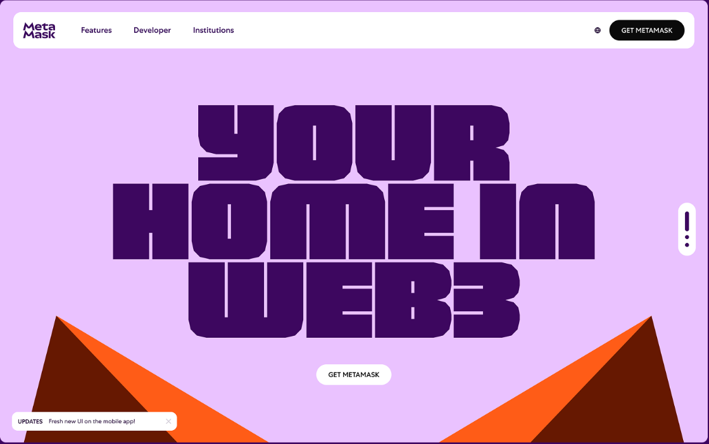

# 👋 Hi, I'm Tony Wangdu 

🚀 **Full-stack & Blockchain Developer** (6+ years)  
💻 Building **SaaS Platforms, Payment Systems & Web3 dApps**  
🌐 Scaled apps to **100k+ users** | Skilled in **Cloud + Blockchain**  

---
## 🛠️ Tech + Portfolio  

### 🔹 [SaaS Platform](#)  
Built with **React + Node.js + PostgreSQL** → scaled to **100k+ users**  

---

### 🔹 [Payment Gateway](#)  
Secure **real-time transactions** with **Express + MongoDB + Stripe**  

---

### 🔹 [DeFi dApp](#)  
Polygon smart contracts built with **Solidity + Web3.js**  

---

## 🚀 Featured Projects  

- 🔹 [**SaaS Platform**](#) – Scaled to 100k+ users, multi-tenant architecture  
- 🔹 [**Payment Gateway**](#) – Secure API, real-time transaction handling  
- 🔹 [**DeFi dApp**](#) – Polygon smart contracts, Web3 integration  
- 🔹 [**E-commerce Platform**](#) – MERN + Stripe payments  

👉 *Check pinned repos for more!*  

---

## 📊 GitHub Stats  

---

## 🏆 Achievements  

- ✅ Built SaaS & dApps used by **100k+ active users**  
- ✅ Designed smart contracts on **Ethereum, Polygon, Solana**  
- ✅ Led dev teams, improving productivity & scalability  

---

